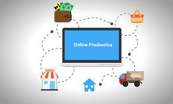

# Online Store 

Este foi o primeiro projeto que trabalhei em uma Squad. E digo mais, foi aqui neste projeto que eu e o pessoal da Squad viramos front-end!! 
Segue o link que compartilhei comemorando junto com a Squad a entrega do projeto:
https://www.linkedin.com/feed/update/urn:li:activity:7020804898669703170/

Online Store foi bem objetivo em sedimentar tudo cada um de nós da Squad apredemos sobre sobre React ⚛️ até aqui neste momento do curso, praticamos a organização de um projeto em time com a metodologia agile Kanban, fizemos isso utilizando a feramenta Trello!!

 Fiquei responsável junto com José Alves em criar componentes para o cliente finalizar a compra ver um resumo dela, preencher também os dados e escolher a forma de pagamento.
 Fiz um pequeno diferencial em criar um componente onde usei API 'https://servicodados.ibge.gov.br/api/v1/localidades/estados/', usei ela para criar a Options de escolha de qual estado pertence o endereço do clientes de compra!!
 
Estou preparando a estilização e umas mudanças para o Online Store!! 

 O trabalho consistiu em construir o Front-End de um e-commerce, uma loja online, alimentada por uma API do Mercado Livre. Conseguimos a nota máxima para esse projeto!!

